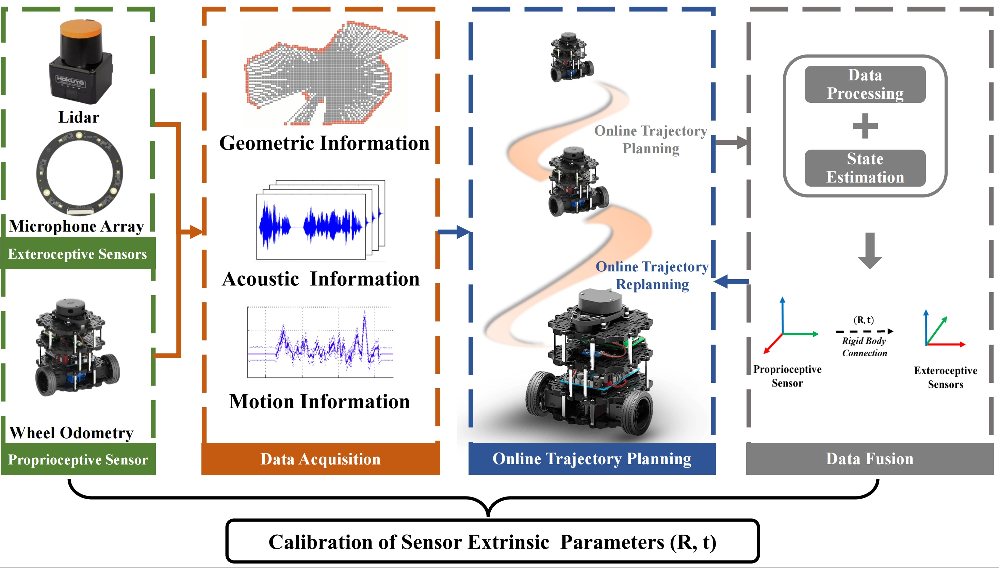
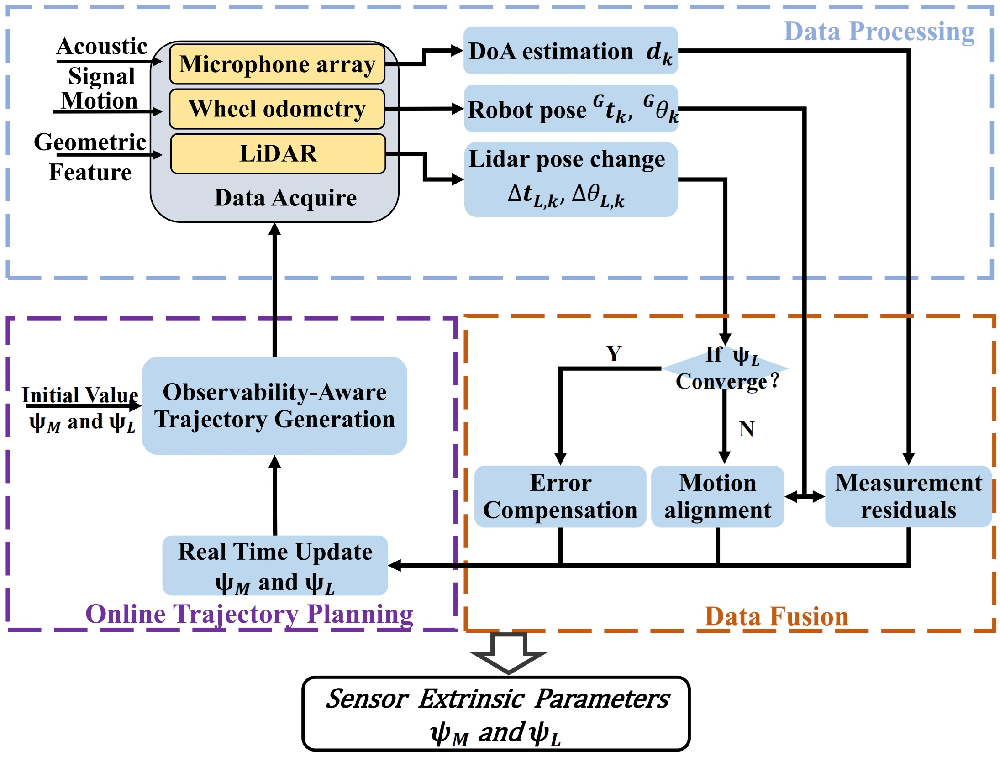

# Observability-Aware Active Calibration of Multi-Sensor Extrinsics
This work proposed an observability-aware active calibration method for ground robots with multimodal sensors, including a microphone array, a LiDAR (exteroceptive sensors), and wheel encoders (proprioceptive sensors).  Unlike traditional approaches, our method enables active trajectory optimization for online data collection and calibration, contributing to the development of more intelligent robotic systems.  Specifically, we leverage the Fisher information matrix (FIM) to quantify parameter observability and adopt its minimum eigenvalue as an optimization metric for trajectory generation via B-spline curves.  Through planning and replanning of robot trajectory online, the method enhances the observability of multi-sensor extrinsic parameters.

<div align="center">
    
    
</div>

## NUMERICAL SIMULATIONS
```bash
python active_calib.py
```

## RUN IN REAL-WORLD
Please refer to the contents in the `real_world` folder.

## License

The source code and dataset are released under [GPLv3](http://www.gnu.org/licenses/) license.

If you use codes or data for your research, please cite:

    @ARTICLE{11048406,
    author={Wang, Jiang and Kang, Yaozhong and Fu, Linya and Nakadai, Kazuhiro and Kong, He},
    journal={IEEE Sensors Journal}, 
    title={Observability-Aware Active Calibration of Multisensor Extrinsics for Ground Robots via Online Trajectory Optimization}, 
    year={2025},
    volume={25},
    number={17},
    pages={33022-33036}
    }
